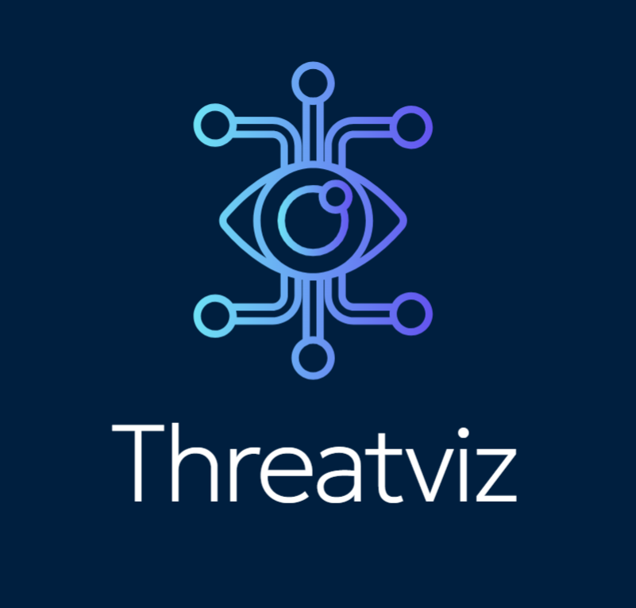
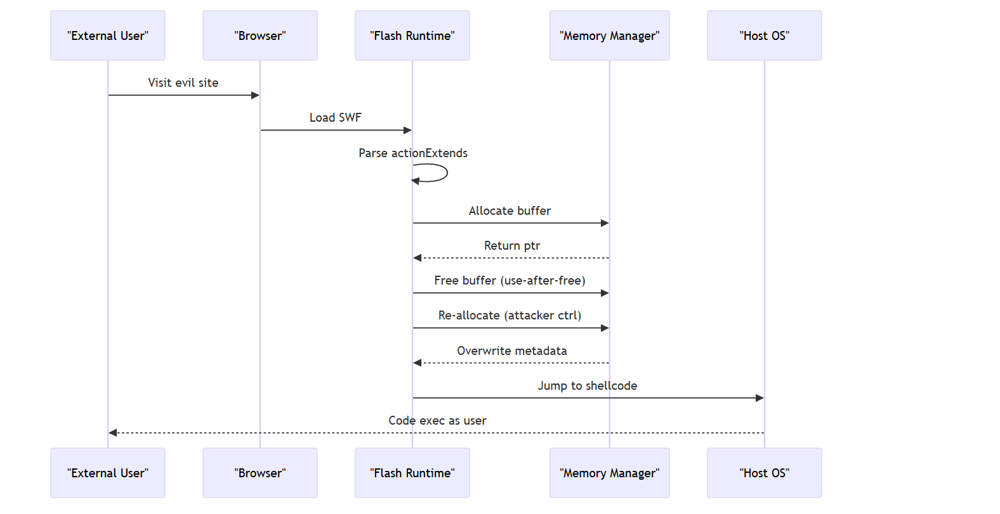
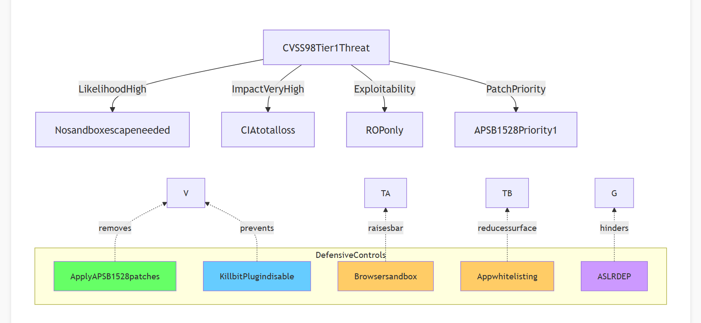
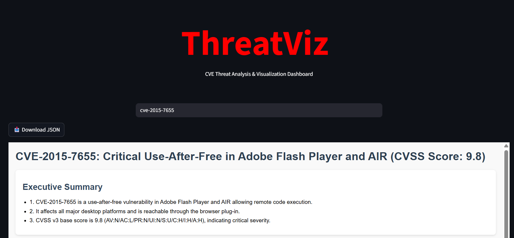
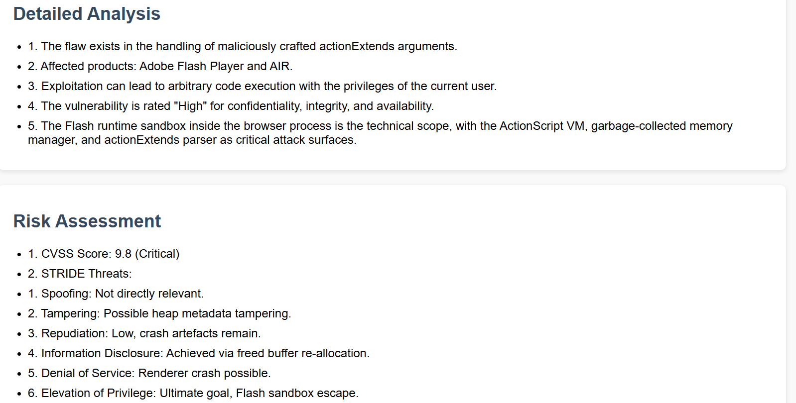
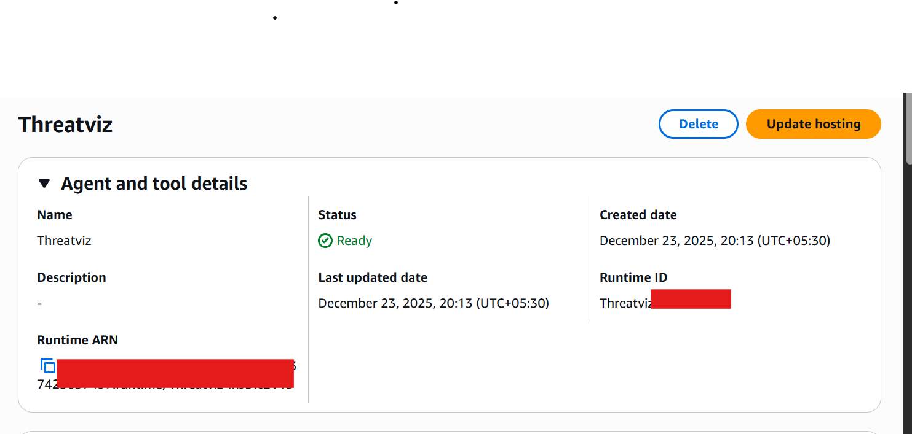
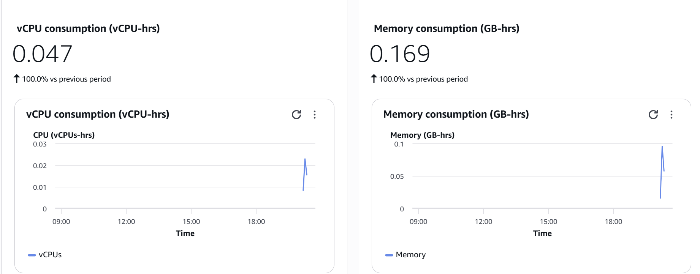
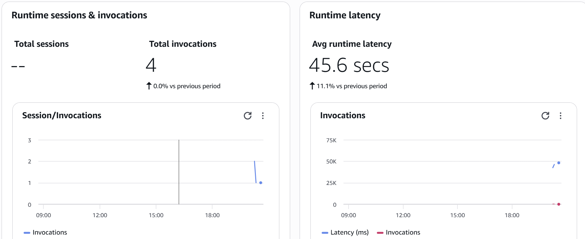

# Threatviz - Turn any CVE into AI Powered Threat modeling 

* Agentic AI based Threat Modeling Technique
* Supports  STRIDE
* Supports PASTA
#### Just put any CVE id in the search box it will turn that to full end to end threat modeling  diagram.


---
### Visualization

----


----

### AI Tech Stack

- Langgraph for multi-agent orchestration
- Faiss for the knowledge base and  RAG
- Groq, OpenAI, Claude and Gemini for model endpoint
- Huggingface for embedding
- Streamlit for Web Interface

### Deployment
- Local Deployment with light weight GUI.
- Deployed and tested using Amazon Bedrock AgentCore and AgentCore memory services
- AWS CloudWatch for observability

### Usage
```
git clone https://github.com/findthead/Threatviz.git
cd Threatviz
uv sync
source .venv/bin/activate   
uv run threatviz.py -id CVE-2025-55182 -html_report 
```

### Host it locally with below command
```
uv run threatviz.py -dashbord
```
### GUI for Local Deployment

----

----
`Note: Working Perfectly with moonshotai/kimi-k2-instruct-0905 from Groq`

---
### Cloudwatch Observability (optional)




---
### Please provide the citation.
```
@software{Threatviz,
  author = {Subhay},
  title = {Threatviz: An autonomous multi-agent Threat Modeling Tool},
  url = {https://github.com/findthehead/Threatviz},
  version = {0.0.2},
  year = {2025}
}
```
---
###### This project is built for the purpose of perticipatating at agentic AI coding and deployment hackathon sponsored by @https://github.com/codebasics
